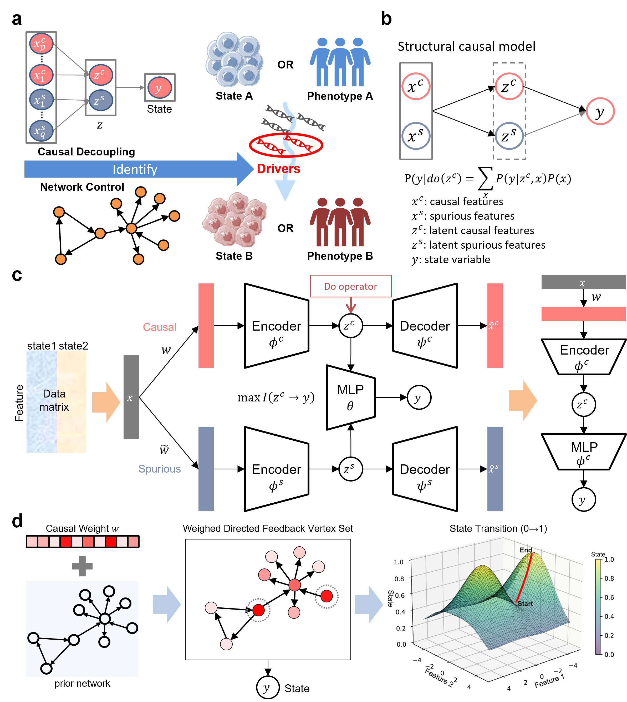

# Steering cell-state and phenotype transitions by causal disentanglement learning

Authors:Chengming Zhang*, Zexi Chen*, Yuanxiang Miao*, Yu Xue, Deyu Cai, Weifeng Guo, Hongbin Ji,  Kazuyuki Aihara, and Luonan Chen

This repository is an official PyTorch implementation of "Steering cell-state and phenotype transitions by causal disentanglement learning"

## Abstract
<p align='center'> </p>
Understanding and manipulating cell-state and phenotype transitions is essential for advancing biological research and therapeutic treatment. We introduce CauFinder, an advanced framework designed to accurately identify causal regulators of these transitions and further to precisely steer such transitions by integrating causal disentanglement modelling with network control based only on the observed data. Leveraging do-calculus and optimizing information flow metrics, CauFinder can distinguish causal factors from spurious ones, ensuring targeted and accurate state control and targeted transition control. One significant advantage of CauFinder is its ability to identify thosee partial variables causally affecting the cell-state or phenotypes transitions among all observed variables, both theoretically and computationally, . leading to the identification of their master regulators when combined with network control. Hence, CauFinder is able effectively to facilitate desirable state transitions or steer these transitional trajectories/paths by modulating these causal drivers. Additionally, CauFinder can quantify causal influence of those key factors/features on the transitions, leading to the identification of master regulators when combined with network control. Furthermore, by employing a counterfactual algorithm on the causal manifold, CauFinder is shown to effectively facilitate controlled and desirable state transitions by modulating these causal drivers. Beyond its theoretical advantages, CauFinder outperforms existing approaches computationally in both simulated and real-world settings. CauFinder is able to not only reveal natural biological transition processes such as (a) cell differentiation, and (b) lung adenocarcinoma (LUAD) to lung squamous cell carcinoma (LUSC) transdifferentiation and (c) drug-sensitive to drug-resistant transitions but also identify the causal regulators of their reverse transition processes, such as (A) cell dedifferentiation, (B) LUSC to LUAD transdifferentiation and (C) drug-resistant to drug-sensitive transitions. These findings highlight its superior ability to causally uncover essential regulatory mechanisms and accurately steer cell-state/phenotype transitions, thus providinge novel therapeutic strategies.

## Installation
Install requirements and dependencies via:
```
conda env create -f environment.yml
```

## Benchmark 
Benchmark evaluation of CauFinder on simulated datasets via:
```
python .\benchmark\multi_layer_nonlinear_simData\bm_simData.py
```

## Run
You can create a new folder such as `new_folder`, then copy the running scripts of any of the experiments such as `.TCGAMR/CF.py` and modify your preprocessing function by mimicking its preprocessing function for `.csv` data such as the function `tcga_data` in `.TCGAMR/CF.py`.

## Citation
In case you found our work useful, please consider citing us:
```
xxx
xxx
xxx
```

## Contact
In case you have questions, please contact xxx and xxx.


